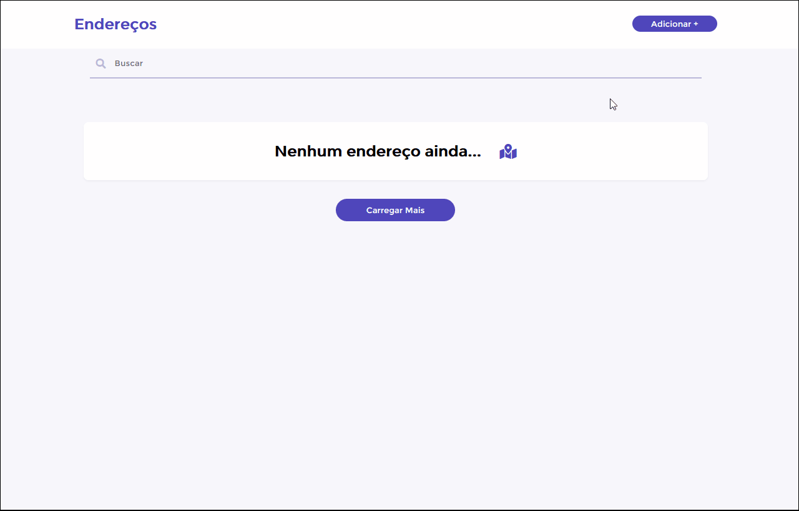

# Listando Endereços com React

## 💻 Sobre o projeto

Esse é o front de uma aplicação web que te possibilita adicionar, editar e remover endereços que ficam salvos em forma de "cards" na página inicial, ideal para gestão de clientes. Página feita como desafio para a vaga de desenvolvedor Front-end da Publi.

<h1 align="center">
    
</h1>

<h1 align="center">
    
</h1>


<br>

## 🧪 Tecnologias usadas

Esse projeto foi desenvolvido com as seguintes tecnologias:

- [React](https://reactjs.org)
- [JavaScript](https://javascript.com)
- [SCSS](https://sass-lang.com/)
- [Styled Components](https://styled-components.com/)

## 🔗  Clone a aplicação

Clone o projeto e acesse a pasta do mesmo.

```bash
$ git clone https://github.com/brunofilho1/address-list-challenge/
$ cd address-list-challenge
```
## 🚀 Como iniciar a aplicação

Para iniciá-lo, siga os passos abaixo:
```bash
# Instalar as dependências
$ npm install
# Iniciar o projeto
$ npm run start
```
O app estará disponível no seu browser pelo endereço http://localhost:3000 assim que iniciado.

## 🌐 Live preview
Sem Live Preview

---
